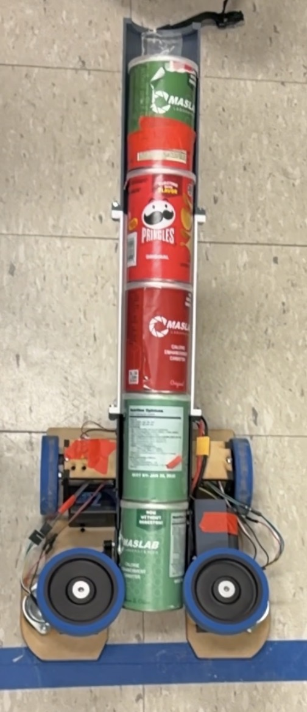
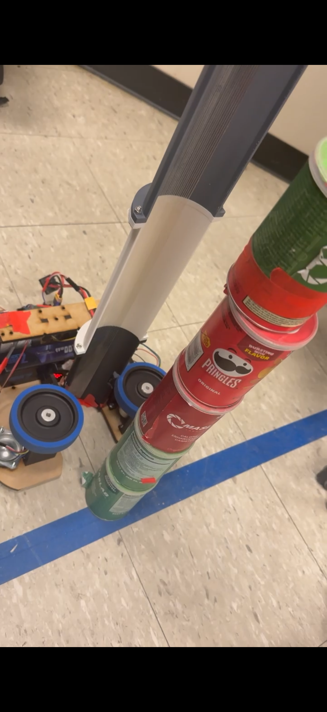
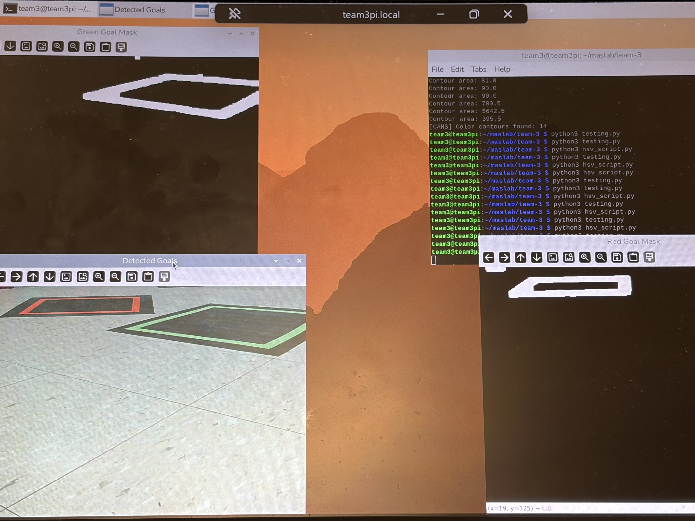
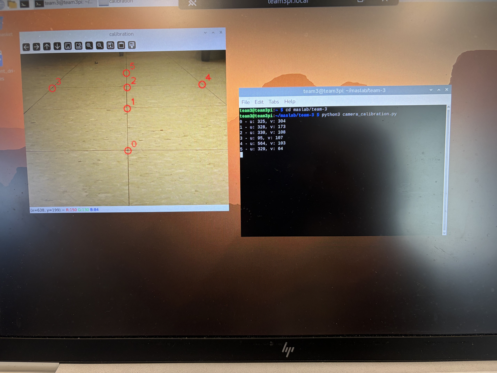

# MASLAB 2026 Team 3 — Autonomous Robot Software

Collaborative software developed for **MIT MASLAB 2026** by a 6-person team. The robot was designed to autonomously navigate randomized courses, identify Pringles cans as scoring objects, and interact with scoring zones using onboard sensing and computer vision.



## My Role

I served as **Head Programmer** on the team. My primary contributions focused on **robot motion and autonomous navigation**, including PID-based control, encoder/IMU odometry, motion profiling, path-following experiments, and movement-system testing/debugging.

I also contributed to the integration and testing of parts of the computer-vision pipeline. This was a collaborative codebase, and files outside my primary contribution areas were developed by other team members.

## My Primary Contributions

- Developed and tuned robot movement and heading-control logic using PID-based feedback
- Implemented and debugged encoder/IMU odometry for robot pose estimation
- Developed trapezoidal and triangular motion-profile logic for smoother acceleration and deceleration
- Worked on quadratic Bézier path generation and pure-pursuit-style lookahead/path-following experiments
- Integrated motion-control code with the team's autonomous behavior
- Assisted with testing and integration of parts of the camera/OpenCV pipeline

## Motion & Controls

The motion stack was designed around closed-loop feedback, pose estimation, and progressively more advanced path-following methods.



Key components include:

- `pid.py` — reusable PID controller logic
- `robot.py` — drivetrain movement, odometry, and heading control
- `motion_profile.py` — trapezoidal/triangular motion-profile generation
- `purepursuit/` — experimental Bézier and pure-pursuit-style path following
- `imu.py` — BNO08X IMU integration

The movement system combined encoder measurements with IMU heading to estimate robot position and orientation, then used that state estimate for autonomous movement and heading correction.

## Vision Testing



The team used an OpenCV-based perception pipeline to identify scoring objects and scoring zones from a mounted camera.

The perception code included:

- HSV and color-threshold tuning
- Contour-based object detection
- Scoring-zone identification
- Camera calibration
- Homography-based coordinate conversion

My involvement in these components was primarily in **integration and testing**, rather than primary development of the vision pipeline.

## Perception & Localization



Camera detections were mapped from image-space coordinates into estimated real-world field coordinates using a calibrated homography. This allowed the autonomous system to reason about detected field objects in the robot's navigation coordinate system.

Relevant files include:

- `camera.py`
- `camera_utils.py`
- `camera_calibration.py`
- `can_detector_api.py`
- `detect_zones.py`
- `get_rw_coord.py`

## Repository Structure

```text
.
├── robot.py                  # Robot movement, odometry, heading control
├── pid.py                    # PID controller utility
├── motion_profile.py         # Motion-profile position generation
├── imu.py                    # IMU interface
├── purepursuit/              # Experimental Bézier / pure-pursuit path following
├── state_machine.py          # Autonomous behavior and state logic
├── camera.py                 # Camera integration
├── camera_utils.py           # Vision utilities
├── camera_calibration.py     # Camera calibration tools
├── can_detector_api.py       # Can-detection interface
├── detect_zones.py           # Scoring-zone detection
├── get_rw_coord.py           # Homography / coordinate transforms
├── jackstuff/                # Additional team localization/control experiments
└── debug_imgs/               # Perception debug outputs
